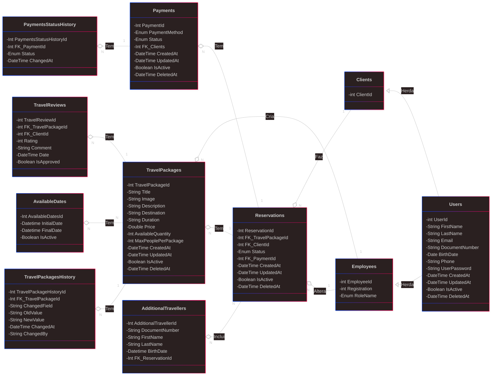

## Entidades:

```mermaid
---
config:
  theme: neo-dark
  look: neo
---
classDiagram
direction RL

class Users {
    -int UserId
    -String FirstName
    -String LastName
    -String Email
    -String DocumentNumber
    -Date BirthDate
    -String Phone
    -String UserPassword
    -DateTime CreatedAt
    -DateTime UpdatedAt
    -Boolean IsActive
    -DateTime DeletedAt
}

class Clients {
    -int ClientId
}

class Employees {
    -int EmployeeId
    -int Registration
    -Enum RoleName
}

class Reservations {
    -Int ReservationId
    -Int FK_TravelPackageId
    -Int FK_ClientId
    -Enum Status
    -Int FK_PaymentId
    -DateTime CreatedAt
    -DateTime UpdatedAt
    -Boolean IsActive
    -DateTime DeletedAt
}

class Payments {
    -Int PaymentId
    -Enum PaymentMethod
    -Enum Status
    -Int FK_Clients
    -DateTime CreatedAt
    -DateTime UpdatedAt
    -Boolean IsActive
    -DateTime DeletedAt
}

class PaymentsStatusHistory {
    -Int PaymentsStatusHistoryId
    -Int FK_PaymentId
    -Enum Status
    -DateTime ChangedAt
}

class TravelReviews {
    -int TravelReviewId
    -int FK_TravelPackageId
    -int FK_ClientId
    -int Rating
    -String Comment
    -DateTime Date
    -Boolean IsApproved
}

class TravelPackages {
    -Int TravelPackageId
    -String Title
    -String Image
    -String Description
    -String Destination
    -String Duration
    -Double Price
    -Int AvailableQuantity     
    -Int MaxPeoplePerPackage
    -DateTime CreatedAt
    -DateTime UpdatedAt
    -Boolean IsActive
    -DateTime DeletedAt
}

class TravelPackagesHistory {
    -Int TravelPackageHistoryId
    -Int FK_TravelPackageId
    -String ChangedField
    -String OldValue
    -String NewValue
    -DateTime ChangedAt
    -String ChangedBy
}

class AvailableDates {
    -Int AvailableDatesId
    -Datetime InitialDate
    -Datetime FinalDate
    -Boolean IsActive
}

class AdditionalTravellers {
    -Int AdditionalTravellerId
    -String DocumentNumber
    -String FirstName
    -String LastName
    -Datetime BirthDate
	-Int FK_ReservationId
}

Users --|> Clients : Herda
Users --|> Employees : Herda
Employees "1" --o "N" TravelPackages : Cria
Clients "1" --o "N" Reservations : Faz
Reservations "1" --o "N" Payments : Tem
TravelPackages "1" --o "N" TravelReviews : Tem
Reservations "1" --o "N" TravelPackages : Tem
TravelPackages "N" --o "N" AvailableDates : Tem
Reservations "N" --o "N" AdditionalTravellers : Inclui
Payments "1" --o "N" PaymentsStatusHistory : Tem
TravelPackages "1" --o "N" TravelPackagesHistory : Tem
Employees "1" --o "N" Reservations: Altera 
```
 
