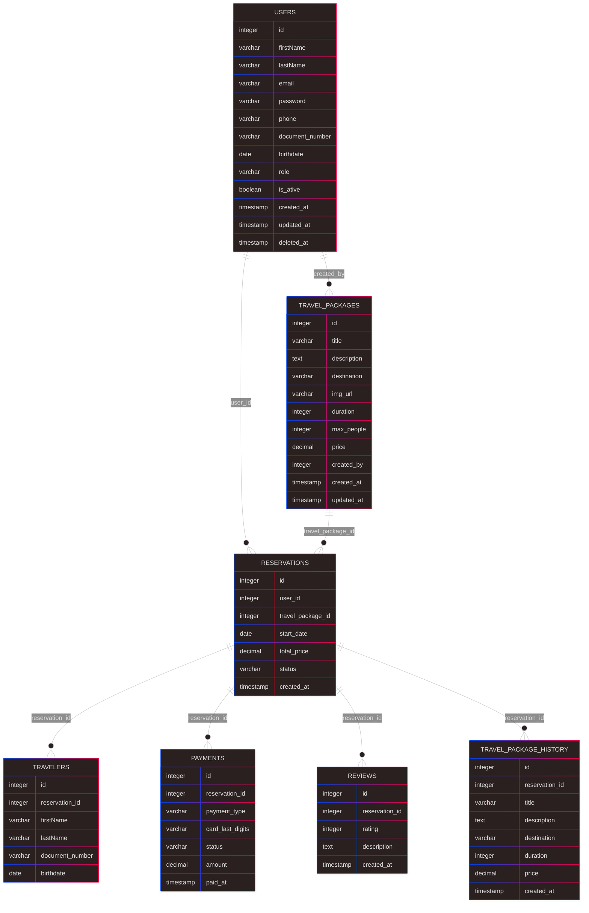

## Entidades:

```mermaid
---
config:
  theme: neo-dark
  look: neo
---
erDiagram
    USERS {
        integer id
        varchar firstName
        varchar lastName
        varchar email
        varchar password
        varchar phone
        varchar document_number
        date birthdate
        varchar role
        boolean is_ative
        timestamp created_at
        timestamp updated_at
        timestamp deleted_at
    }

    TRAVEL_PACKAGES {
        integer id
        varchar title
        text description
        varchar destination
        varchar img_url
        integer duration 
        integer max_people
        decimal price
        integer created_by
        timestamp created_at
        timestamp updated_at
    }

    TRAVEL_PACKAGE_HISTORY {
        integer id
        integer reservation_id
        varchar title
        text description
        varchar destination
        integer duration
        decimal price
        timestamp created_at
    }

    RESERVATIONS {
        integer id
        integer user_id
        integer travel_package_id
        date start_date
        decimal total_price
        varchar status
        timestamp created_at
    }

    TRAVELERS {
        integer id
        integer reservation_id
        varchar firstName
        varchar lastName
        varchar document_number
        date birthdate
    }

    PAYMENTS {
        integer id 
        integer reservation_id
        varchar payment_type
        varchar card_last_digits
        varchar status
        decimal amount
        timestamp paid_at
    }

    REVIEWS {
        integer id 
        integer reservation_id
        integer rating
        text description
        timestamp created_at
    }

    %% Relacionamentos
    USERS ||--o{ TRAVEL_PACKAGES : "created_by"
    USERS ||--o{ RESERVATIONS : "user_id"
    TRAVEL_PACKAGES ||--o{ RESERVATIONS : "travel_package_id"
    RESERVATIONS ||--o{ TRAVELERS : "reservation_id"
    RESERVATIONS ||--o{ PAYMENTS : "reservation_id"
    RESERVATIONS ||--o{ REVIEWS : "reservation_id"
    RESERVATIONS ||--o{ TRAVEL_PACKAGE_HISTORY : "reservation_id"


```
 
