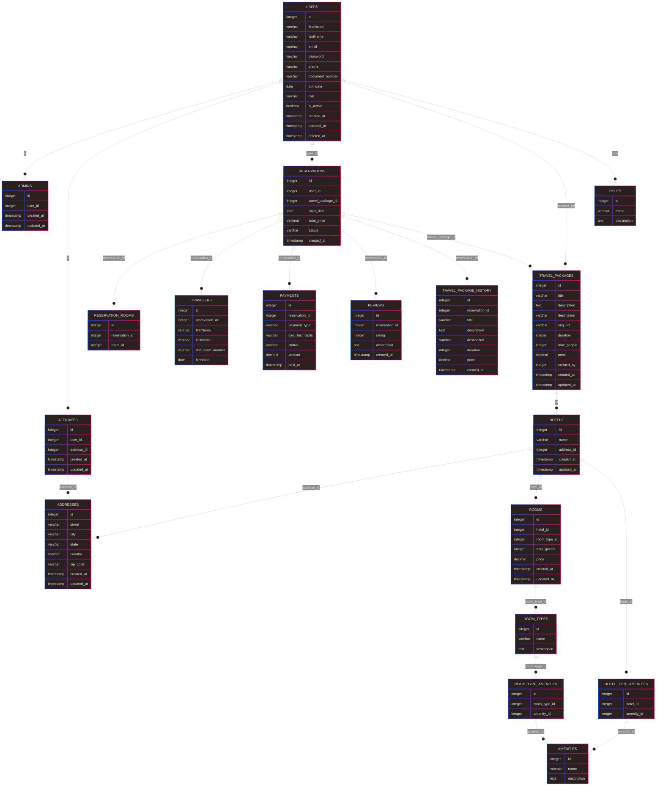

# Viagium

Sistema completo para gestão de viagens, pacotes, reservas, usuários, afiliados, hotéis e pagamentos, desenvolvido em .NET Core.

## Sobre o Projeto

O Viagium é uma API robusta que permite o gerenciamento de todo o ciclo de uma viagem, desde o cadastro de usuários, afiliados e hotéis, até a reserva de pacotes, quartos, pagamentos e avaliações. O sistema foi projetado para ser modular, seguro e escalável, utilizando arquitetura MVC, Entity Framework Core para persistência, AutoMapper para mapeamento de entidades e autenticação JWT.

## Principais Funcionalidades

- Cadastro, autenticação e gerenciamento de usuários, administradores e afiliados
- CRUD de pacotes de viagem, hotéis, quartos, tipos e amenidades
- Reservas de pacotes e quartos
- Processamento de pagamentos
- Sistema de avaliações (reviews)
- Histórico de alterações dos pacotes
- Controle de permissões por roles
- Testes unitários para controllers e serviços

## Estrutura do Projeto

- **Controllers/**: Gerenciam as rotas e requisições HTTP
- **Models/**: Entidades do domínio
- **EntitiesDTO/**: Data Transfer Objects para comunicação entre camadas
- **Repository/**: Repositórios para acesso ao banco de dados
- **Services/**: Lógica de negócio e validações
- **Configurations/**: Configurações globais (ex: JWT)
- **Data/**: Contexto do Entity Framework Core
- **Migrations/**: Migrações do banco de dados
- **ProfileAutoMapper/**: Perfis de mapeamento entre entidades e DTOs
- **Properties/**: Configurações de inicialização
- **Viagium.tests/** e **ViagiumTests/**: Testes unitários

## Como Executar

1. Configure o banco de dados em `appsettings.json`
2. Execute as migrações do Entity Framework Core
3. Inicie o projeto via Rider ou Visual Studio
4. Teste as rotas da API com Postman ou similar

## Tecnologias Utilizadas

- .NET Core
- Entity Framework Core
- AutoMapper
- JWT Authentication

## Entidades do Domínio

O Viagium possui diversas entidades que representam os principais conceitos do sistema. Abaixo estão as principais models e suas funções:

- **User**: Usuários do sistema, incluindo dados pessoais, autenticação e permissões.
- **Admin**: Administradores do sistema, com permissões elevadas.
- **Affiliate**: Afiliados parceiros para venda de pacotes.
- **Address**: Endereços vinculados a usuários, hotéis e afiliados.
- **Hotel**: Hotéis disponíveis nos pacotes de viagem.
- **HotelTypeAmenity**: Relação entre tipos de hotéis e amenidades.
- **Amenity**: Amenidades oferecidas pelos hotéis/quartos.
- **Room**: Quartos disponíveis nos hotéis.
- **RoomType**: Tipos de quartos (ex: suíte, standard).
- **RoomTypeAmenity**: Relação entre tipos de quartos e amenidades.
- **Reservation**: Reservas realizadas pelos usuários.
- **ReservationRoom**: Relação entre reservas e quartos reservados.
- **Traveler**: Viajantes associados a uma reserva.
- **Payment**: Pagamentos realizados para reservas.
- **Review**: Avaliações de pacotes, hotéis ou reservas.
- **Role**: Perfis de acesso e permissões dos usuários.
- **TravelPackage**: Pacotes de viagem disponíveis.
- **TravelPackageHistory**: Histórico de alterações dos pacotes.

## Entidades:

 
